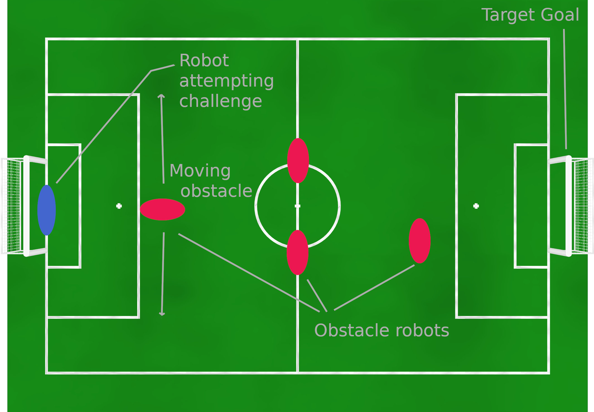

# Obstacle avoidance challenge

Technical Challenge for RoboCup 2020 SPL Championship. Version from 3. Mar 2020.

## Goal

Teams at RoboCup 2019 self-reported working on/having finished improvements of their obstacle avoidance. Replacing the most simple obstacle avoidance implementation (don't walk forward if you don't see field color in front of you) should be encouraged by the league. This challenge gives teams to display their improvements in obstacle avoidance. It might aid in lowering the amount of pushing during games.

## Setup

A ball is placed at kickoff point. The challenged robot is placed in front of the center circle facing the target goal.  Between ball and target goal three obstacles are placed.

- One robot as an obstacle, facing down the long dimension of the field, centered on the imaginary line between kickoff point and center of the target goal.
- One robot as an obstacle, facing down the long dimension of the field, offset to the left or right so its outermost shoulder point is a balls radius away from the imaginary line between kickoff point and center of the target goal.
- Two robots  as an obstacles, facing down the long dimension of the field, positioned offset to the sides so dribbling a ball in between them is the fastest route to the target goal. The space in between them the sum of the robots shoulder-to-shoulder width and a balls diameter.

The order of the obstacles are set up in is randomized by dice throw at the competition before the first team is challenged. Thus no team is aware of the exact setup beforehand and all teams face the same challenge.

Obstacle robots may wear any jersey. Which jerseys are not specified beforehand so teams can't prepare for specific jerseys.

The team currently challenged and the two upcoming teams are present at the field and may set up their robots for the challenge. Teams are informed of their order of participation in the challenge by the judges. Thus avoiding the whole league joining a single fields wireless AP.

## Scoring

The challenged robot is tasked to advance with the ball into the target goal. Both dribbling and short kicks are permitted. Shots into the goal are only allowed within one meter from the end field line.

Teams are scored by the time it took to move the ball into the goal (rounded to full seconds). Lower durations are better.

The obstacles move sideways. Touching an obstacle with the ball increases the scored duration by 5 seconds. Touching an obstacle with the challenged robot increases the scored duration by 10 seconds. 

A robot has at most 90 seconds (penalties excluded) to complete the challenge.

## Miscellaneous comments

Do we need to specify who provides the moving obstacles?
  
Do we need to better specify the range of the obstacle movements? (i.e. how many steps/meters)

Do we need to better specify the short kicks proprieties? (e.g. not more than X meters)